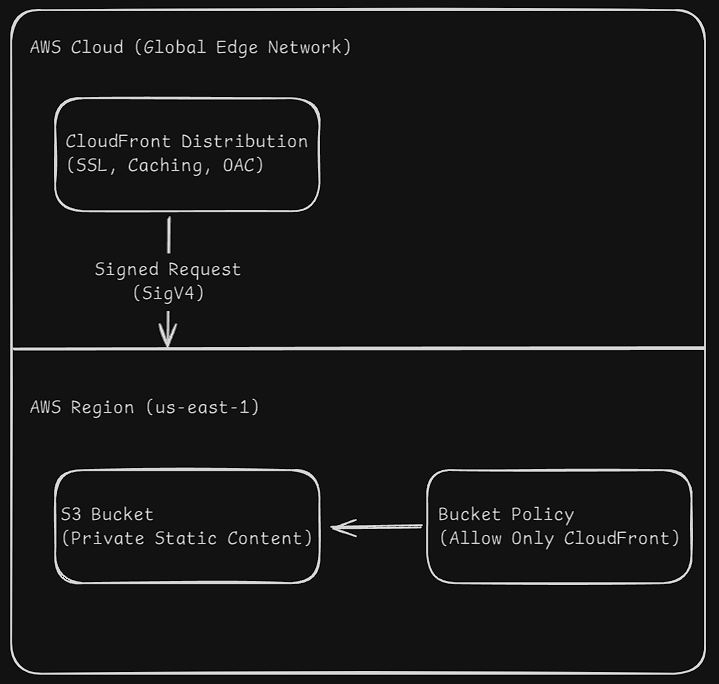

# Secure Angular Static Web App on AWS

A modern, cloud-native web application built with Angular 21, designed for high performance, security, and scalability. This project demonstrates a production-grade Infrastructure as Code (IaC) setup using Terraform to deploy a Secure Static Website Hosting solution on AWS.

## 🏗 Architecture

The solution leverages **AWS CloudFront** for global content delivery and **Amazon S3** for secure, private storage. Access to the S3 origin is strictly controlled via **Origin Access Control (OAC)**, ensuring that content can only be accessed through the distribution.



### Key Architectural Decisions

- **Security First (OAC)**: Unlike the legacy Origin Access Identity (OAI), we utilize **Origin Access Control (OAC)** which supports **SigV4**, offering better security, region support, and authorization capabilities.
- **Private Origin**: The S3 bucket is completely private. `BlockPublicAccess` is enabled, and the Bucket Policy explicitly allows `s3:GetObject` **only** from the specific CloudFront Distribution ARN.
- **Performance**: CloudFront caches content at the edge (PoPs), reducing latency for global users and offloading traffic from the origin.
- **Cost Efficiency**: S3 handles storage cheaply, while CloudFront optimizes data transfer costs and reduces requests to S3 via caching.

---

## 🚀 Technology Stack

- **Frontend**: Angular 21 (Latest) & TailwindCSS
- **Infrastructure**: Terraform v1.5+
- **Cloud Provider**: AWS (S3, CloudFront)
- **Scripting/Tools**: npm, AWS CLI

---

## 📂 Project Structure

```text
.
├── src/                # Angular application source code
├── infra/              # Terraform Infrastructure as Code
│   ├── main.tf         # Core infrastructure (S3, CloudFront, Policies)
│   ├── variables.tf    # Configurable inputs (Region, Project Name)
│   ├── outputs.tf      # Useful outputs (CloudFront URL, Bucket Name)
│   └── ...
├── angular.json        # Angular CLI configuration
└── package.json        # Project dependencies
```

---

## 🛠 Getting Started

### Prerequisites

- Node.js (v20+ recommended)
- Angular CLI (`npm install -g @angular/cli`)
- Terraform CLI
- AWS CLI (configured with appropriate credentials)

### 1. Local Development

Install dependencies and start the development server:

```bash
npm install
npm start
```

Navigate to `http://localhost:4200/`.

### 2. Infrastructure Deployment

Initialize and apply the Terraform configuration to provision the AWS resources.

```bash
cd infra

# Initialize Terraform (download providers)
terraform init

# Review the plan
terraform plan -out=tfplan

# Apply the infrastructure
terraform apply tfplan
```

> **Note**: The apply step will output the `cloudfront_domain_name` and `s3_bucket_name`. Keep these handy for the deployment step.

### 3. Production Build & Deploy

Once the infrastructure is ready, build the Angular app and sync it to S3.

```bash
# Return to root directory
cd ..

# Build for production
npm run build

# Sync build artifacts to the S3 bucket
# Replace <YOUR_BUCKET_NAME> with the output from Terraform
aws s3 sync dist/interview/browser s3://<YOUR_BUCKET_NAME> --delete
```

After synchronization, your application will be available at the CloudFront URL provided by the Terraform output.

---

## 🔒 Security Features

- **TLS/SSL**: CloudFront provides a default viewer certificate (`*.cloudfront.net`) enforcing HTTPS.
- **Geo-Restriction**: Configurable in `main.tf` (currently set to global allow, can be restricted by country).
- **S3 Permissions**:
  - `block_public_acls = true`
  - `restrict_public_buckets = true`
  - Policy enforces `AWS:SourceArn` check for the CloudFront distribution.
